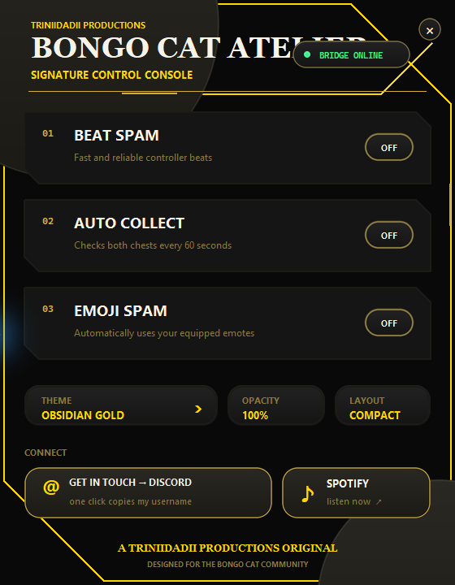
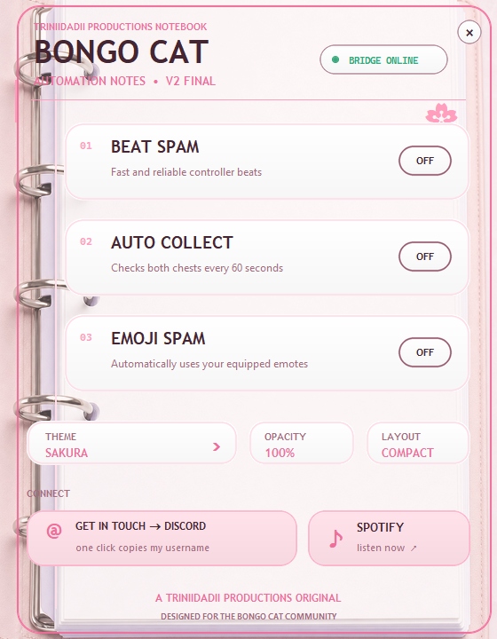
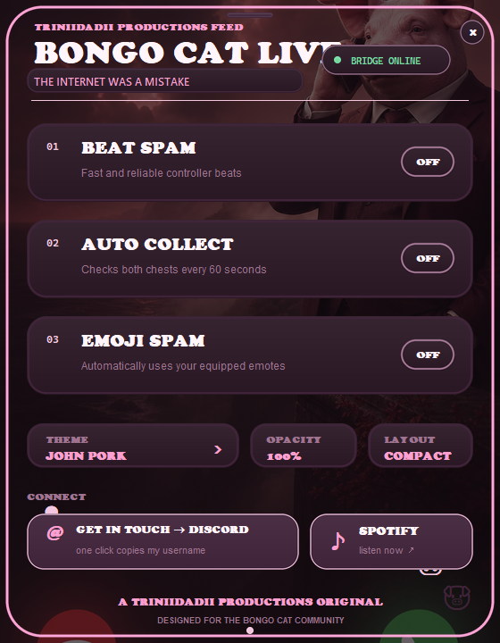

  

<h1 align="center">AUTO BONGO V2</h1>

<b>Beat Spam · Auto Chest Collector · Emoji Spammer</b>

by <b>Triniidadii Productions</b>

  <a href="https://open.spotify.com/artist/4oLdOm6VP4eyo40CIguViO">Spotify</a> ·
  Discord: <b>Triniidadii_productions</b>

---

AUTO BONGO V2 is a Windows automation controller for the Steam **Bongo Cat**
application. It combines high-speed controller beats with cursorless chest and
emoji automation in a compact, heavily customizable desktop interface.

## Download

**[Download the newest Windows release](../../releases/latest)**

Download `AUTO-BONGO-V2.0.0-Windows-x64.zip`, verify the accompanying SHA-256
file if desired, extract the ZIP, and read `README.txt` before installation.

## Features

- **Beat Spam** uses the proper ViGEm virtual Xbox controller layer.
- **Auto Collect** reads Bongo Cat's real chest-ready state every 60 seconds.
- **Emoji Spam** invokes equipped reusable emotes directly inside the game.
- **Cursorless automation:** Auto Collect and Emoji Spam never move the Windows
  mouse or steal focus from another application.
- **Full and compact layouts** with persistent preferences.
- **68 themes** across Signature, Pastel, Grunge, Digital, and Memes.
- Department-specific shapes, typography, artwork, and ambient animation.
- Four-times supersampled UI surfaces for clean anti-aliased curves.
- Adjustable window transparency.
- One-click Discord copy and Spotify access.

## In-app preview

  
  
  

<i>Signature precision, pastel notebook polish, and full internet-brainrot mode.</i>

## Installation

1. Close Bongo Cat.
2. Extract the release ZIP.
3. Double-click **`Install AUTO BONGO V2.bat`**.
4. Approve the Windows administrator prompt.
5. Launch **AUTO BONGO V2** from the new desktop or Start Menu shortcut.

The installer automatically:

- detects Bongo Cat across configured Steam libraries;
- installs the ViGEm virtual-controller driver;
- backs up the user's current Bongo Cat game assembly;
- installs the cursorless automation bridge;
- creates branded desktop and Start Menu shortcuts; and
- installs a rollback uninstaller.

## Important

- Requires 64-bit Windows 10 or Windows 11, Steam, and Bongo Cat.
- Enable **Controller Inputs** inside Bongo Cat for Beat Spam.
- A Bongo Cat update may restore its game assembly. If the cursorless bridge is
  unavailable after an update, rerun the AUTO BONGO V2 installer.
- This free community build is not code-signed. Windows may display an
  unknown-publisher or SmartScreen warning. Release checksums are provided.

## Uninstall

Open **Start Menu → Triniidadii Productions → Uninstall AUTO BONGO V2**.

The uninstaller restores the exact original Bongo Cat assembly saved during
installation and removes the cursorless bridge, shortcuts, and application.

## Special thanks

- **[Bela](https://steamcommunity.com/profiles/76561198992897176)** for feature
  requests that helped push the project beyond its original scope.
- **[daclumsyasian](https://steamcommunity.com/profiles/76561199231027721)** for
  being the first person to use the application and helping test it before the
  original public release.

## Technology and licenses

- [vgamepad](https://github.com/yannbouteiller/vgamepad) — MIT
- [ViGEmBus](https://github.com/ViGEm/ViGEmBus) — BSD-3-Clause
- [Mono.Cecil](https://www.mono-project.com/docs/tools+libraries/libraries/Mono.Cecil/) — MIT
- Python, Tkinter, Pillow, pywin32, and PyInstaller

Third-party notices are available in
[`THIRD-PARTY-LICENSES.txt`](THIRD-PARTY-LICENSES.txt) and inside every release.

## License

**Proprietary software. Copyright 2026 Triniidadii Productions. All rights
reserved.** You receive a limited personal-use license, not ownership. You may
share the official link or an exact, untouched release with clear attribution;
you may not modify, reverse engineer, decompile, extract, rebrand, resell, or
reuse its systems in another project. The software is provided as-is and used
entirely at your own risk. See the complete [proprietary license](LICENSE).

---

<i>Made by Triniidadii Productions for the Bongo Cat community.</i>

<!--
Yo... why are you all the way down here, bro?
Ain't shit in here. You GitHub lurkers really do read EVERYTHING lmfao.
Since you made it this far: drink some water, collect your chests, and act like you never saw this.
-->
