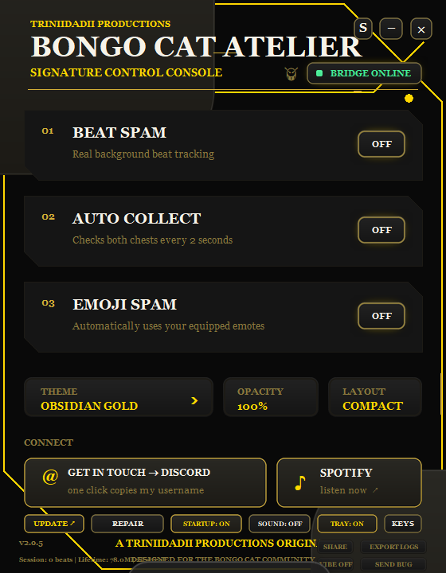
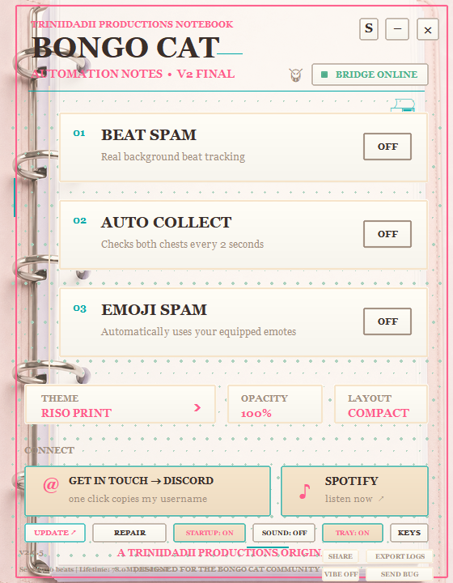
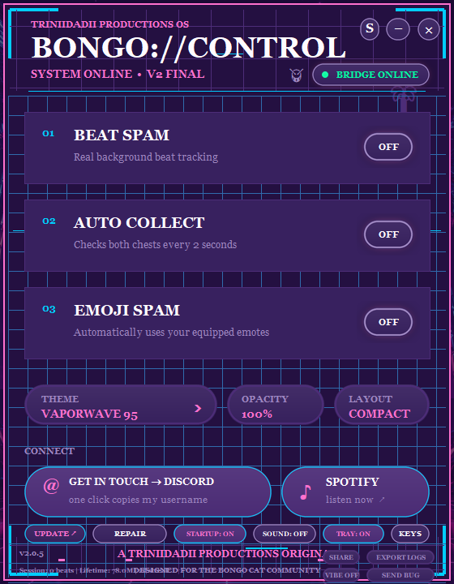
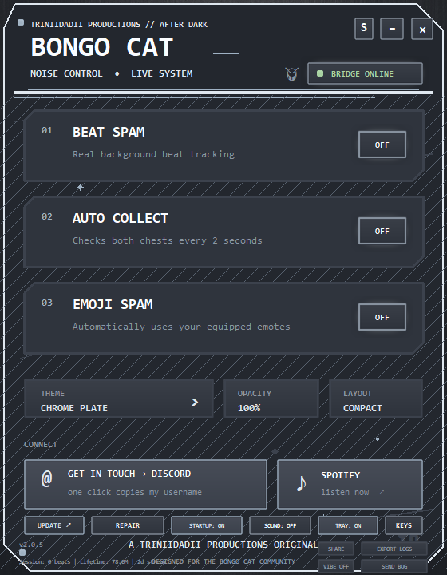

  

## Download

**[Download the newest Windows release](../../releases/latest)**

**[Steam Community guide](https://steamcommunity.com/sharedfiles/filedetails/?id=3759650867)** ·
**[Version 2.0.5 guide mirror](STEAM_GUIDE.md)**

Download `AUTO-BONGO-V2.0.5-Windows-x64.zip`, verify the accompanying SHA-256
file if desired, extract the ZIP, and read `README.txt` before installation.

### Version 2.0.5

- The full theme-universe overhaul. Every one of the 93 themes now has its own
  font, corner shape, border style, background texture, and motion layer, so
  switching themes actually changes how the whole app feels, not just the
  colors.
- Six brand-new themes with real painted backdrop art: Blueprint, Riso Print,
  Chrome Plate, Vaporwave 95, Phosphor Amber, and Candy Shop.
- New background textures (scanlines, dots, grids, grain, circuits, waves,
  stars, halftone) and subtle motion layers that follow the theme you pick.
- A smarter updater: the app checks GitHub by itself every few hours, shows an
  update badge with the changelog right inside the app, and verifies every
  download with SHA-256 before installing anything.
- Self-healing bridge: when a Steam update breaks the game-side bridge, the app
  detects it and the REPAIR BRIDGE button fixes the installation without a full
  reinstall.
- Diagnostic logs plus one-click EXPORT LOGS and SEND BUG buttons, so bug
  reports reach us with everything we need.
- Startup health check confirms the bridge, driver, and game state every time
  the app launches.
- Session and lifetime stats with a SHARE button that saves a stat card image
  to your Desktop.
- Optional start-with-Windows toggle and custom keybinds (rebind the global
  F-key hotkeys to whatever you like).
- Minimize fixed: proper taskbar minimize in both layouts, with optional
  minimize-to-tray.
- 14 unlockable secret themes, including Spotify-listening tiers.
- Achievements, daily streaks, collect sounds, and milestone celebrations.
- Optional beta update channel for early builds.

## Features

- **Beat Spam** runs through the game-side background bridge, with ViGEm kept
  as a legacy fallback.
- **Auto Collect** reads both real chest-ready states every two seconds and
  purchases a ready chest directly inside the game.
- **Emoji Spam** invokes equipped reusable emotes directly inside the game.
- **Cursorless automation:** Auto Collect and Emoji Spam never move the Windows
  mouse or steal focus from another application.
- **Fail-safe automation:** a live controller heartbeat disables the in-game
  bridge within five seconds if AUTO BONGO V2 closes or stops responding.
- **Single-instance protection** prevents duplicate controllers from competing.
- **Full and compact layouts** with persistent preferences.
- **Proper taskbar minimize** controls in both layouts.
- **One-click update check** opens the official latest GitHub release.
- **93 themes including 14 unlockable secret themes** across Signature,
  Pastel, Grunge, Digital, Memes, Seasonal, and Secrets.
- Per-theme fonts, shapes, textures, and ambient animation.
- Four-times supersampled UI surfaces for clean anti-aliased curves.
- Adjustable window transparency.
- One-click Discord copy and Spotify access.

## In-app preview

  
  
  
  

<i>Every theme now brings its own font, shapes, texture, and motion. These are four of the 93.</i>

## Installation

1. Close Bongo Cat.
2. Extract the release ZIP.
3. Double-click **`Install AUTO BONGO V2.bat`**.
4. Approve the Windows administrator prompt.
5. Launch **AUTO BONGO V2** from the new desktop or Start Menu shortcut.

The installer automatically:

- verifies every packaged file against the included SHA-256 manifest before
  changing the system or game;
- detects Bongo Cat across configured Steam libraries;
- installs the ViGEm virtual-controller driver;
- backs up the user's current Bongo Cat game assembly;
- installs the cursorless automation bridge;
- creates branded desktop and Start Menu shortcuts; and
- registers AUTO BONGO V2 in Windows Installed Apps with a rollback uninstaller.

## Important

- Requires 64-bit Windows 10 or Windows 11, Steam, and Bongo Cat.
- Enable **Controller Inputs** inside Bongo Cat for Beat Spam.
- A Bongo Cat update may restore its game assembly. If AUTO BONGO V2 reports
  **Bridge update required**, download the newest official release and rerun its
  installer. It detects the newer clean assembly and refreshes the uninstall
  backup safely.
- This free community build is not code-signed. Windows may display an
  unknown-publisher or SmartScreen warning. Release checksums are provided.

## Uninstall

Open **Start Menu → Triniidadii Productions → Uninstall AUTO BONGO V2**.

The uninstaller restores the exact original Bongo Cat assembly saved during
installation and removes the cursorless bridge, shortcuts, and application.

## Special thanks

- **[Bela](https://steamcommunity.com/profiles/76561198992897176)** for feature
  requests that helped push the project beyond its original scope.
- **[daclumsyasian](https://steamcommunity.com/profiles/76561199231027721)** for
  being the first person to use the application and helping test it before the
  original public release.
- **[LordErdbeere](https://steamcommunity.com/id/lorderdbeere)** for reporting
  post-update bugs and requesting proper full minimization.

## Technology and licenses

- [vgamepad](https://github.com/yannbouteiller/vgamepad) — MIT
- [ViGEmBus](https://github.com/ViGEm/ViGEmBus) — BSD-3-Clause
- [Mono.Cecil](https://www.mono-project.com/docs/tools+libraries/libraries/Mono.Cecil/) — MIT
- Python, Tkinter, Pillow, pywin32, and PyInstaller

Third-party notices are available in
[`THIRD-PARTY-LICENSES.txt`](THIRD-PARTY-LICENSES.txt) and as `LICENSES.txt`
inside every release.

## License

**Proprietary software. Copyright 2026 Triniidadii Productions. All rights
reserved.** You receive a limited personal-use license, not ownership. You may
share the official link or an exact, untouched release with clear attribution;
you may not modify, reverse engineer, decompile, extract, rebrand, resell, or
reuse its systems to build or ship another version or competing project. No
right is granted to use the Triniidadii Productions name, services, identity,
or the owner's likeness for advertising, endorsement, monetization, or promotion.
The software is provided as-is and used entirely at your own risk. See the
complete [proprietary license](LICENSE).

**Zero tolerance for malicious use:** no hijacking, infection, unauthorized
access, malware, surveillance, credential or data theft, fraud, sabotage, or
interference with another person's devices, accounts, files, or services.
Malicious use immediately terminates the license, leaves the responsible person
solely liable, and may be reported to affected parties and law enforcement.

---

<i>Made by Triniidadii Productions for the Bongo Cat community.</i>

<!--
Yo... why are you all the way down here, bro?
Ain't shit in here. You GitHub lurkers really do read EVERYTHING lmfao.
Since you made it this far: drink some water, collect your chests, and act like you never saw this.
-->
